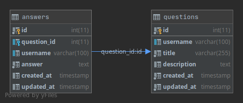

# README #
### What is this repository for? ###

* Quick summary
Go Developer Coding Challenge. QuestionsAndAnswers.com

### How do I get set up? ###

* Requirements
    * Golang
    * MongoDB
* Steps
    * Clone the repository`git clone git@bitbucket.org:aveaguilar/questions_and_answers.git`
    * The service uses a dotenv configuration for the database connection. 
    Rename the *.env.example* file `cp .env.example .env`
    * Update the environment variables inside *.env* to the ones of your database
* How to run tests
    * From the root of the project you can run one of the following commands:
        * `go test ./..` to run tests
        * `go test -cover -count=1 ./..` to run with coverage and without cached results
### Database Schema ###

* ER Diagram

In a relational database structure, we can represent the interaction between our entities with a 1:N relationship. 
Each answer belongs to a single question, but a question can have multiple answers.

Nonetheless, I decided to go for a NoSQL, document database (mongodb) instead of a relational database. 
This is a convenient approach because we can model 1:N relationships just by embedding the answers as part of a question
which simplifies the query needed to fetch a question with all its answers. 

When designing mongodb relationships, it is necessary to ask how big is the data we will be working with. On this case,
I considered improbable that the amount of answers for a given question will ever reach a number that could impact
the performance. Therefore, instead of having a separate collection just for answers, I decided to embed.

### API interface ###

* [Postman Documentation](https://documenter.getpostman.com/view/6076972/TVK77LTJ)

### What could be improved? ###
* Add authentication layer
* Add the missing endpoints for manipulating the answers. Given the limited time, I focused on the ones required.
This could also imply a re-organize the code. Having the full set of answers endpoints makes creating an independent
package more useful to preserve order.
* I would like to have an factory to connect to different databases. Relational or not. I could include a *driver* enviroment
variable to let the app know which db engine should be using.
* Better error handling.
* A user interface

### Who do I talk to? ###

* Ellery Aguilar (ellery.aguilar@avantica.com)
